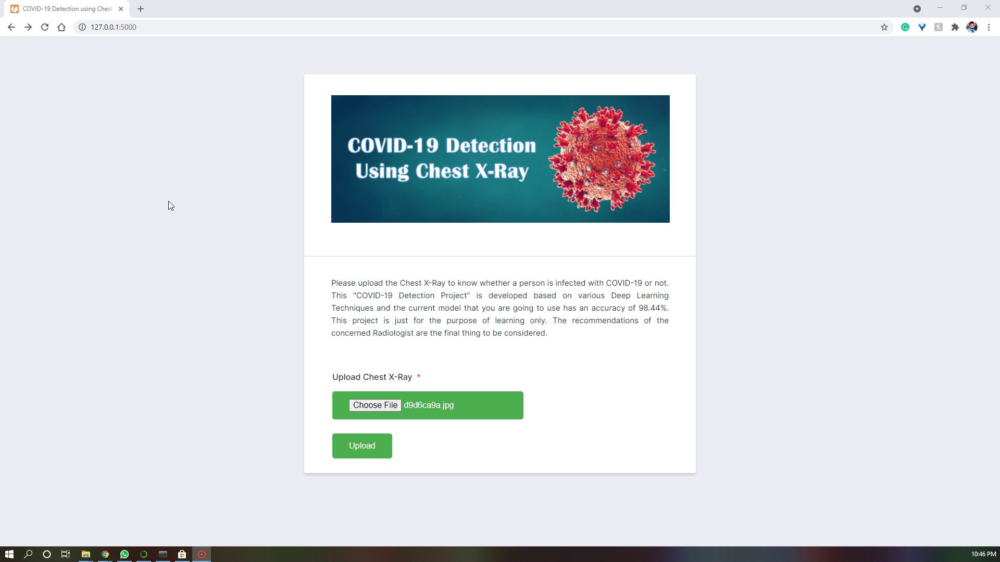

# Automatic Detection of COVID-19 using Deep Learning from Chest X-Ray Images

## Following is the Demo of the Project

## Link for the Deployed App
https://covid19-detection-cxr.herokuapp.com/

## Introduction
The pandemic, originated by Novel Coronavirus-2019 (COVID-19), continuing its devastating effect on the health, well-being, and economy of the global population. The early detection and diagnosis of COVID-19 and the accurate separation of COVID infected cases at the lowest cost in the early stage is the main challenge in the current scenario. A critical step to restrain this pandemic is the early detection of COVID-19 in the human body, to constraint the exposure and control the spread of the virus. Chest X-Rays are one of the non-invasive tools to detect this disease as the manual PCR diagnosis process is quite tedious and time-consuming. Concerning the novelty of the disease, diagnostic methods based on radiological images suffer from shortcomings despite their many applications in diagnostic centers. Accordingly, medical and computer researchers tend to use machine-learning models to analyze radiology images.

In this project, a Deep Learning Model has been developed for the automatic detection of COVID-19. The Model will predict whether a patient is infected with Corona Virus or not by analysing the Chest X-Ray Image of the patient. The model is developed to provide accurate diagnosis for Binary Classification (COVID +ve or COIVD -ve). The developed model achieved an average classification of 98.46%. 

In this project, we have attempted to develop an automated COVID-19 classifer, utilizing available COVID and non-COVID Chest X-Ray datasets. 

### **The following are the steps involved in this project:**
- Importing the necessary packages
- Data Collection and Preprocessing
- Building a CNN based model in Keras
- Compiling the Model
- Processing the Training and Testing Images
- Training the Model
- Evaluating the Model
- Saving the Model
- Creating a Classification Method

### **Data Collection and Preprocessing:**
#### **Data Collection:**
For building this project we have to mainly rely on two types of Chest X-Rays. They are:
1. **COVID** infected patients Chest X-Rays,
2. **Non-COVID** patients Chest X-Rays like Pneumonia, Tuberculosis etc.

For **COVID** X-Rays we have downloaded the Chest X-Rays from [GitHub.](https://github.com/ieee8023/covid-chestxray-dataset) (Mix of COVID Positive and other diseases)

And for **Non-COVID** X-Rays we have downloaded the data from [Kaggle.](https://www.kaggle.com/paultimothymooney/chest-xray-pneumonia) (Chest X-Rays of Pneunomia patients)

#### **Data Preprocessing:**
There are a total of 930 Chest X-Rays available at the time of doing this project, out of which 196 are labelled as **COVID Positive.** So we have extracted those images from the complete dataset using the metadata. 

And from the Pneunomia Chest X-Rays Dataset we have selected the equal number of **Normal Chest X-Rays** (196 Normal Chest X-Rays) and labelled them as **COVID Negative or Non COVID.** 

#### **Data Split:**
Out of the total available 392 X-Rays (196-COVID, 196-Non COVID), 25% (49 X-Rays) are separated for Validation and the remaining 75% (147 X-Rays) are used for Training the model.

Seperated them in Train and Validation Datasets and organised in folders as follows:
- Dataset
  - Train
    - COVID
    - Normal
  - Validation
    - COVID
    - Normal

    and uploaded them to Dropbox for future use. The link of the seggregated data set is given [here](https://www.dropbox.com/s/tlsdn617iymz3bf/CovidDataset.zip) in `.zip` format.

### **Building a CNN based model in Keras:**

In this project implementation we have used Convolutional Neural Networks (CNN or CovnNet), a complex feed forward neural networks for image classification with high accuracy. The CNN follows a hierarchical model which works on building a network, like a funnel which finally gives out a fully-connected layer where all the neurons are connected to each other and the output is processed. 
 
 

 
 
We have added all the layers in a Sequential model. As we are classifying images we used `Conv2D` Layers stacked upon eachother.

**Conv2D** is a 2D Convolution Layer which creates a convolution kernel that is  with layers input which helps produce a tensor of outputs. In image processing kernel is a convolution matrix or masks which can be used for blurring, sharpening, embossing, edge detection, and more by doing a convolution between a kernel and an image. In this we use the appropriate number of filters which are to be obtained from the image. It is always in powers of 2. 

**MaxPooling2D** layers are used to reduce the dimensions of the feature maps as it reduces the number of parameters to learn and the amount of computation performed in the network. The pooling layer summarises the features present in a region of the feature map generated by a convolution layer

**Dropout** layers are added to prevent a model from overfitting and increasing the time and space complexity. This happens due to the co-adoptation of individual neurons in NN. Dropout works by randomly setting the outgoing edges of hidden units (neurons that make up hidden layers) to 0 at each update of the training phase. The dropout rate is between 0 and 1.

**Flatten** layer converts the pooled feature map to a single column that is passed to the fully connected layer. For example, if flatten is applied to layer having input shape as (batch_size, 2,2), then the output shape of the layer will be (batch_size, 4).

**Dense** layer connects to each neuron in the previous layer and recieves inputs from all the neurons. Dense layers adds an interesting non-linearity property by modelling any mathematical function. The dense layer is found to be the most commonly used layer in the models.

The input layer of the model is a `Cov2D` layer with `32 filters`, kernel size of `(3, 3)`, input shape of `(224, 224, 3)` and activation function `'relu'`.

Then a stack of `Conv2D` layer, `MaxPooling2D` Layer and a `Dropout` layers are created for feature extraction. 

We have used `sigmoid` activation function in the output layer as we have to predict whether it is a COVID or Non-COVID X-Ray which is a binary classification problem. 

### **Compiling the Model:**

After successfully creating the model, we have to compile the model with three parameters like `loss`, `optimizer`, and `metrics`. 

- We use `binary_crossentropy` as we are working on binary classification problem. 
- Among the optimizers like `adam`, `adagrad`, `sgd`, and `rmsprop`, we have selected the `adam` optimizer with its default learning rate (0.001). 
- We have taken `accuracy` from metrics. 

### **Processing the Training and Testing Images:**

As we are having less number of images we have to apply some Data Augmentation techniques for making our training process more effecient and time saving too. For this we can use `ImageDataGenerator` which can rescale, flip, shrink and apply many more transformations on our images to make the network learn better. 

Then we create train generator and validation generator with batch size of 32 images. 

## Conclusion:
The developed model is working well for new uploads also. The future work of the project is to further try to increase the model accuracy to above 99.5%. 
